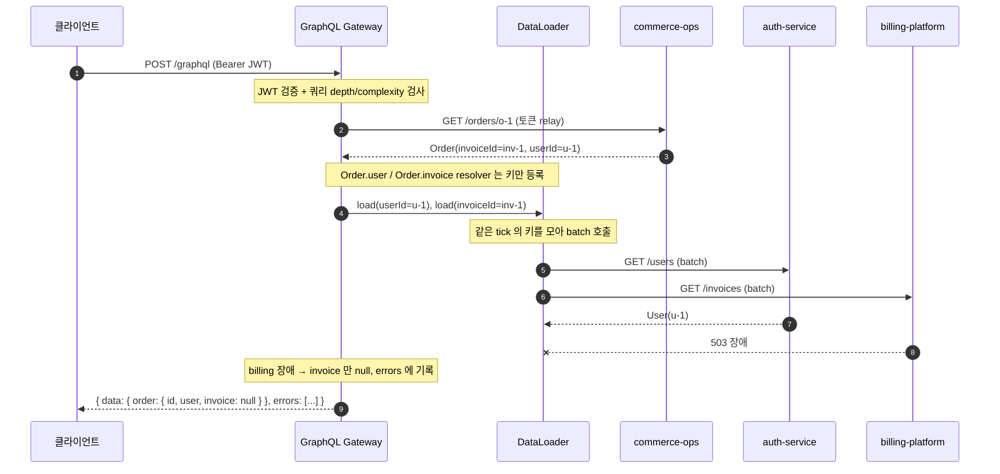
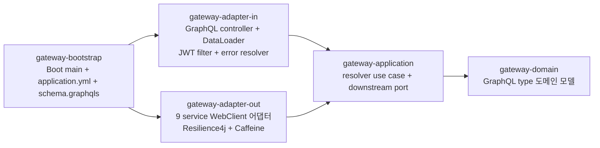

# GraphQL Gateway

[](https://github.com/ssa1004/graphql-gateway/actions/workflows/ci.yml)
[](https://github.com/ssa1004/graphql-gateway/actions/workflows/codeql.yml)
[](https://openjdk.org/projects/jdk/21/)
[](https://kotlinlang.org/)
[](https://spring.io/projects/spring-boot)
[](LICENSE)

9개의 백엔드 service 가 각자 노출하는 REST API 를, 클라이언트가 한 endpoint 로 조회할 수
있게 묶는 GraphQL 게이트웨이입니다. 여러 service 의 데이터를 한 쿼리로 조합하고, service
경계를 가로지르는 조인(예: 주문에서 인보이스로)을 GraphQL schema 안에서 자연스럽게
표현합니다.

이 레포는 같은 사용자가 운영하는 포트폴리오 백엔드 묶음의 **facade** 입니다 — 9개 service
위에 올라가, 그 묶음을 클라이언트 관점에서 하나의 그래프로 보이게 합니다.

## 무엇을 푸는가

여러 백엔드를 쓰는 클라이언트(웹 / 앱)는 한 화면을 그리려고 service 를 따로 호출하고 응답을
직접 조합합니다. 호출 수가 많고, 조합 로직이 클라이언트마다 중복됩니다.

이 게이트웨이는 그 조합을 서버 쪽으로 옮깁니다. 클라이언트는 `/graphql` 한 곳에 "필요한
데이터의 모양" 을 보내고, 게이트웨이가 9개 service 를 호출해 그 모양대로 채워 돌려줍니다.

- **over-fetching 제거** — 클라이언트가 쓸 필드만 골라 받습니다.
- **호출 합치기** — 한 화면에 필요한 여러 service 호출이 한 GraphQL 쿼리가 됩니다.
- **조인의 서버화** — `Order.invoice` 같은 service 간 연결을 게이트웨이가 처리합니다.
- **부분 실패 흡수** — downstream 한 곳이 죽어도 그 필드만 비고 쿼리 전체는 삽니다.

## 기술 스택

- **Language**: Kotlin 2.0 (100% Kotlin — Java 소스 0), Java 21 toolchain
- **Framework**: Spring Boot 3.4, Spring for GraphQL
- **비동기**: Kotlin Coroutines (suspend resolver), Reactor
- **N+1 방지**: DataLoader (`@BatchMapping` / `BatchLoaderRegistry`)
- **downstream 호출**: WebClient (non-blocking)
- **장애 격리**: Resilience4j (서킷 브레이커, 재시도, 타임아웃)
- **인증**: Spring Security (OAuth2 Resource Server, JWT)
- **캐시**: Caffeine
- **Build / CI**: Gradle 8 (Kotlin DSL), GitHub Actions, Docker, Helm
- **아키텍처**: 헥사고날 (5개 모듈)

## 핵심 설계 결정

설계 결정의 상세 배경은 [docs/adr/](docs/adr/) 의 ADR 9건에 정리되어 있습니다.

### 1. BFF 형태의 게이트웨이

각 service 에 GraphQL subgraph 를 심는 Federation 대신, 게이트웨이가 downstream REST 를
직접 호출하고 schema 를 단독 소유하는 BFF 형태를 택했습니다. downstream 9 service 는 이미
REST 로 구현돼 있고, GraphQL 을 몰라도 됩니다. ([ADR-0001](docs/adr/0001-graphql-gateway-role.md))

### 2. DataLoader 로 N+1 방지

조인 필드(`Order.invoice` 등)는 resolver 가 downstream 을 직접 호출하지 않고 DataLoader 에
키만 등록합니다. graphql-java 가 한 tick 의 키를 모아 batch 로 한 번에 조회하므로, 주문을
N개 펼쳐도 billing-platform 호출이 N+1 에서 1묶음으로 줄어듭니다.
([ADR-0002](docs/adr/0002-dataloader-n-plus-1.md))

### 3. downstream 장애 격리와 부분 실패

모든 downstream 호출을 Resilience4j(서킷 브레이커 + 재시도 + 타임아웃)로 감쌌습니다.
service 단위로 회로를 분리해, billing-platform 이 죽어도 auth-service 호출은 영향을 받지
않습니다. GraphQL 의 부분 실패 모델을 활용해, 한 downstream 장애를 그 필드만의 실패로
격리합니다 — `order { id, invoice }` 에서 billing 이 죽으면 `invoice` 만 null 이 되고
`id` 는 정상 응답됩니다. ([ADR-0003](docs/adr/0003-downstream-resilience.md))

### 4. JWT 검증과 token relay

게이트웨이는 OAuth2 resource server 로 동작해, 들어온 JWT 를 auth-service 의 JWK Set 으로
검증합니다. 토큰을 새로 발급하지 않고 원본 JWT 를 downstream 호출에 그대로 relay 하므로,
인증 주체가 auth-service 하나로 유지됩니다. ([ADR-0004](docs/adr/0004-jwt-auth-token-relay.md))

### 5. 쿼리 complexity / depth 제한

GraphQL 은 클라이언트가 쿼리 모양을 정하므로, 깊거나 넓은 쿼리 하나가 게이트웨이와 9개
downstream 을 한꺼번에 끌어내릴 수 있습니다. graphql-java instrumentation 으로 depth /
complexity 한계를 두어, 한계를 넘는 쿼리는 실행 전에 거부합니다 (downstream 호출 0).
([ADR-0008](docs/adr/0008-query-complexity-depth-limit.md))

### 6. downstream 계약 변경 흡수

downstream REST 응답은 DTO 로 받고 게이트웨이 도메인 모델로 변환합니다. downstream 스펙이
바뀌어도 변환 계층만 고치면 GraphQL schema 와 resolver 는 그대로입니다. WireMock contract
test 가 downstream 계약을 회귀로 잡아 줍니다. ([ADR-0009](docs/adr/0009-downstream-contract-change.md))

## 시스템 흐름

`order { id, user, invoice }` 쿼리 한 건이 처리되는 흐름입니다. DataLoader 가 조인을 batch
로 합치고, downstream 한 곳이 죽으면 그 필드만 빠집니다.



## 모듈 구조

헥사고날 아키텍처 — 의존 방향은 안쪽(domain)을 향합니다.



| 모듈 | 책임 |
|---|---|
| `gateway-domain` | GraphQL type 의 도메인 모델. Spring / GraphQL 라이브러리 의존성 0 (Kotlin) |
| `gateway-application` | resolver use case, downstream port 인터페이스, token relay 계약 (Kotlin) |
| `gateway-adapter-in` | GraphQL controller (`@QueryMapping` / `@SchemaMapping` / `@BatchMapping`), DataLoader 등록, JWT 보안, error resolver, 쿼리 가드 (Kotlin) |
| `gateway-adapter-out` | 9개 downstream service WebClient 어댑터, Resilience4j, Caffeine 캐시, stub 어댑터 (Kotlin) |
| `gateway-bootstrap` | Spring Boot 진입점, `application.yml`, `schema.graphqls`, 통합 테스트 (Kotlin) |

## Quick Start

downstream 9 service 가 떠 있지 않아도 게이트웨이를 실행할 수 있습니다. `demo` 프로필이
in-memory stub 어댑터로 downstream 응답을 대신하고 JWT 인증을 끕니다.

> `make help` 로 전체 명령을 볼 수 있습니다. 가장 빠른 길:
> ```bash
> make up                            # 게이트웨이 기동 (demo 프로필 — stub 어댑터)
> make demo                          # 9 service 조회 + 조인 GraphQL 쿼리 시연
> open http://localhost:8080/graphiql  # GraphQL playground
> ```
> 호스트에서 직접 띄우려면 `make run` (= `./gradlew :gateway-bootstrap:bootRun`).

### Gradle 로 실행

```bash
./gradlew :gateway-bootstrap:bootRun --args='--spring.profiles.active=demo'
```

### Docker Compose 로 실행 + 시연

```bash
docker compose up --build -d
./integration-demo.sh          # 9 service 조회 + 조인 GraphQL 쿼리 시연
```

`integration-demo.sh` 는 사용자 조회, 3-service 조인(`order` + `user` + `invoice`),
거래/피드 조인, 검색 페이징, 한 쿼리로 여러 service 동시 조회, mutation 까지 한 사이클을
자동 실행합니다.

### GraphQL playground

브라우저에서 GraphiQL 로 직접 쿼리할 수 있습니다.

```
http://localhost:8080/graphiql
```

## GraphQL schema

전체 SDL 은 [gateway-bootstrap/src/main/resources/graphql/schema.graphqls](gateway-bootstrap/src/main/resources/graphql/schema.graphqls)
에 있습니다.

### Query 진입점 — 9 service

| 쿼리 | downstream service |
|---|---|
| `user(id)` | auth-service |
| `order(id)` | commerce-ops |
| `trade(id)` | bid-ask-marketplace |
| `invoice(id)` | billing-platform |
| `job(id)` | gpu-job-orchestrator |
| `search(q, first, after)` | search-service |
| `securityAlerts(tenantId, first, after)` | security-log-search |

### federation 조인 — DataLoader 로 batch

| 조인 필드 | 연결 |
|---|---|
| `Order.user` | commerce-ops → auth-service |
| `Order.invoice` | commerce-ops → billing-platform |
| `Trade.feed` | bid-ask-marketplace → realtime-feed-service |
| `User.notifications` | auth-service → notification-hub |
| `GpuJob.submitter` | gpu-job-orchestrator → auth-service |

### Mutation

게이트웨이는 조회(BFF) 위주이고 쓰기는 각 service REST 를 직접 호출하는 것이 원칙이라,
mutation 표면을 최소로 둡니다.

| mutation | downstream service |
|---|---|
| `markNotificationRead(id)` | notification-hub |

### 쿼리 예시

```graphql
# 주문 하나에서 주문자와 인보이스를 한 번에 — 3개 service 가 조인된다.
query {
  order(id: "o-1") {
    id
    status
    totalAmount
    user { id email displayName }      # auth-service
    invoice { id status totalAmount }  # billing-platform
  }
}
```

```graphql
# 여러 service 를 한 쿼리로 — REST 라면 3번 호출할 것이 한 번에 끝난다.
query {
  user(id: "u-1") { displayName }
  trade(id: "t-2") { id price status }
  invoice(id: "inv-2") { id period totalAmount }
}
```

## 테스트

`./gradlew check` 로 전체 테스트가 돌고, downstream 9 service 는 떠 있지 않아도 됩니다 —
WireMock 과 stub 어댑터로 모든 테스트가 자족적으로 동작합니다.

| 테스트 | 범위 |
|---|---|
| `CursorCodecTest` (domain) | Relay cursor 인코딩 / 디코딩 |
| `GatewayQueryServiceTest` (application) | use case 위임, DataLoader batch 빈-입력 처리 |
| `WebUserAdapterTest` (adapter-out) | WireMock 으로 WebClient + Resilience4j (200 / 404 / 5xx) |
| `GatewayApplicationContextTest` (bootstrap) | demo 프로필 Spring 컨텍스트 적재 — 빈 배선 + schema 매핑 + DataLoader 등록 |
| `GatewayGraphQlTest` (bootstrap) | `GraphQlTester` 로 9 service 조회 + 조인 + 페이징 + mutation |
| `DownstreamWireMockTest` (bootstrap) | WireMock downstream — 정상 변환 + 부분 실패 (5xx 격리) |
| `QueryGuardTest` (bootstrap) | depth / complexity 한계 초과 쿼리 거부 |

```bash
./gradlew check                       # 전체
./gradlew :gateway-bootstrap:test     # GraphQlTester + WireMock 통합 테스트
```

## 배포 (Helm)

```bash
# 기본 (dev) — stub 어댑터, 인증 off
helm install graphql-gateway ./helm/graphql-gateway -n portfolio

# 운영 — 실제 9 service 호출, JWT 인증 on, HPA + PDB + NetworkPolicy
helm upgrade --install graphql-gateway ./helm/graphql-gateway \
  -n portfolio -f helm/graphql-gateway/values-prod.yaml
```

차트는 stateless 게이트웨이용입니다 — DB / Redis / Kafka 가 없고, 외부 의존은 9개
downstream service 와 auth-service 의 JWK Set HTTP endpoint 뿐입니다.

## Portfolio Set 통합

이 레포는 단독으로도 동작하지만, 같은 사용자가 운영하는 10개 백엔드 레포가 한 시스템처럼
맞물리는 구성의 일부입니다. 프로필: <https://github.com/ssa1004>.

이 게이트웨이는 그 묶음의 **facade** 입니다 — 아래 9개 service 위에 올라가 GraphQL 한
endpoint 로 묶습니다.

### 10 레포 한눈 표

| 레포 | 역할 | 본 레포 (graphql-gateway) 와의 관계 |
|---|---|---|
| `auth-service` | 사용자 인증 + JWT 발급 | `Query.user` 의 대상. 게이트웨이가 JWK Set 으로 JWT 검증 |
| `commerce-ops` | 커머스 주문 처리 | `Query.order` 의 대상 |
| `bid-ask-marketplace` | 한정판 리셀 마켓 (BID/ASK 매칭) | `Query.trade` 의 대상 |
| `billing-platform` | 사용량 과금 / 청구 / 정산 | `Query.invoice` + `Order.invoice` 조인의 대상 |
| `gpu-job-orchestrator` | GPU job 스케줄러 | `Query.job` 의 대상 |
| `search-service` | 통합 검색 | `Query.search` 의 대상 |
| `security-log-search` | 보안 로그 수집 / 검색 | `Query.securityAlerts` 의 대상 |
| `notification-hub` | 다채널 알림 (이메일/푸시/SMS) | `User.notifications` 조인의 대상 |
| `realtime-feed-service` | 실시간 피드 | `Trade.feed` 조인의 대상 |
| **`graphql-gateway`** | **본 레포 — 9 service 통합 GraphQL 게이트웨이** | — |

### 통합점

- **들어오는** — 클라이언트가 `auth-service` 발급 JWT(Bearer)로 `/graphql` 호출.
  게이트웨이가 JWK Set 으로 서명을 검증한다.
- **나가는** — 게이트웨이가 9개 service 의 REST 를 WebClient 로 호출하고, 들어온 JWT 를
  그대로 relay 한다. downstream 이 같은 토큰을 각자 다시 검증한다.

## 문서

- [docs/adr/](docs/adr/) — 아키텍처 결정 기록 (ADR) 9건
- [docs/backend-skills-index.md](docs/backend-skills-index.md) — 이 레포가 시연하는 백엔드 패턴을 "코드 위치 → 왜(ADR) → 이론([dev-lab](https://github.com/ssa1004/dev-lab))" 으로 잇는 학습 인덱스 (공부 목적)
- [docs/security/owasp-mapping.md](docs/security/owasp-mapping.md) — OWASP API Security Top 10 (2023) 매핑
- [CONTRIBUTING.md](CONTRIBUTING.md) — 개발 흐름, commit 규칙
- [SECURITY.md](SECURITY.md) — 보안 정책, 취약점 보고

## 라이선스

[MIT](LICENSE)
